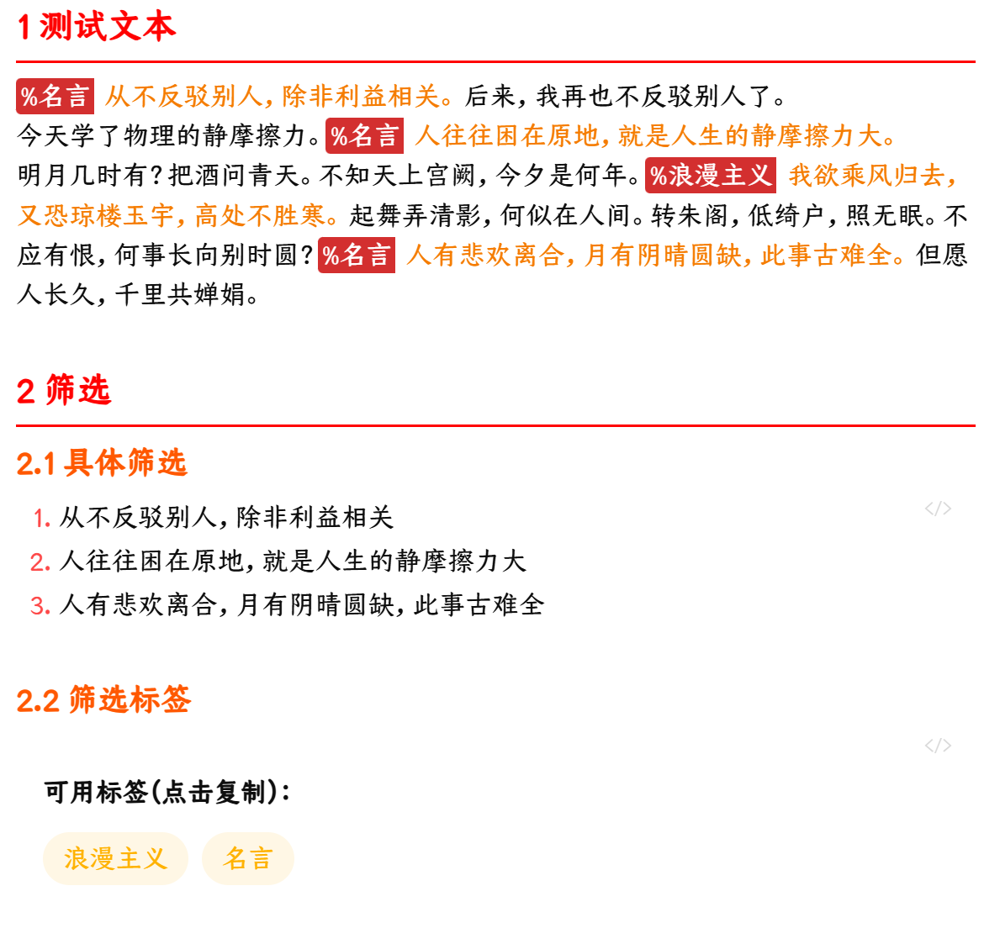

# 1 说明
这是 obsidian 的一个插件。
obsidian 的 tag 其实非常重量级，是针对整个文档的。而简标签则是针对一个句子的，侧重轻量级、随时捕捉灵感。

# 2 特性
1. 语法简单：`%+标签+空格+内容+中文句号`
2. 支持筛选：类似 tasks、dataview，语法类似（高仿）
3. 支持高亮：类似 aDHL，设置面板可设置默认颜色、对不同标签进行设置

# 3 例子
## 3.1 例句
```markdown
%名言 夏虫不可语冰。
```

## 3.2 筛选
```markdown
'''tag
list
from 名言
'''
```
## 3.3 查询语法

```
[展示格式]：list、table、bullet
FROM [标签名...]：可以多个，空格连接
[WHERE 条件]
[SORT BY 字段 [ASC|DESC]]
[LIMIT 数量]
```
空查询搜索所有标签

# 4 截图



